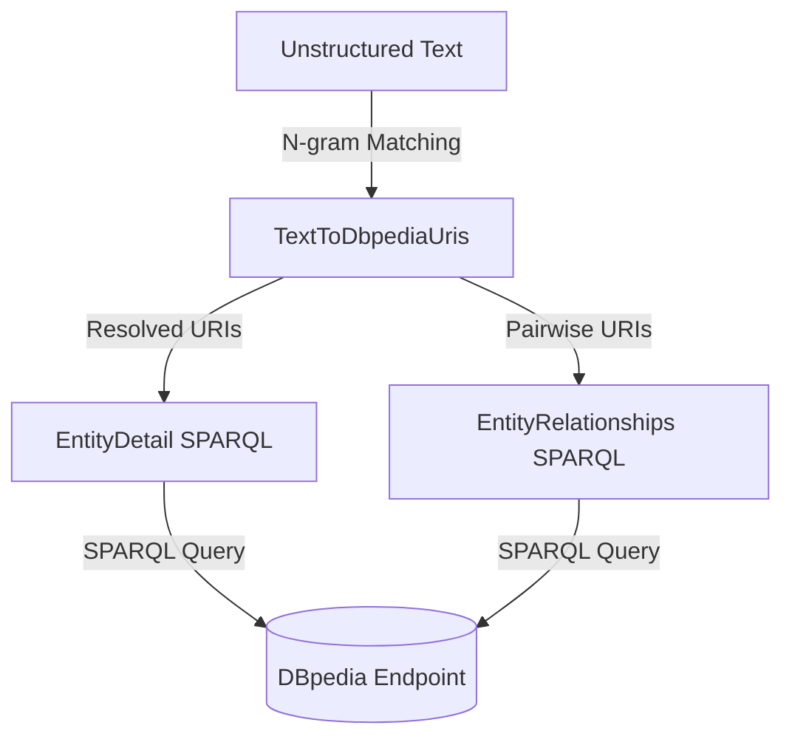

# Knowledge Graph Navigator (KGN)

A primary challenge in AI is bridging the gap between unstructured human language and structured knowledge. In this chapter, we build a **Knowledge Graph Navigator (KGN)** in Scala 3. KGN parses unstructured natural language sentences, extracts recognized entities, resolves them to global Uniform Resource Identifiers (URIs) on DBpedia, and queries the DBpedia SPARQL endpoint to fetch detailed biographies and discover relationships between the entities.

All code is in `source-code/kgn`.

## How KGN Works

KGN implements a lightweight pipeline:
1. **Entity Mapping**: Parse input text and match n-grams against dictionary lists (gazetteers) linking common terms to DBpedia URIs.
2. **Detail Retrieval**: For each extracted entity, query its properties (e.g. spouse, Alma Mater, net income, population) using specialized SPARQL templates.
3. **Relationship Discovery**: Query DBpedia to find semantic edges that directly connect pairs of extracted entities.



## Extracting and Resolving Entities

In **kgn/TextToDbpediaUris.scala**, we load maps for categories such as people, companies, cities, and countries from text files. 

When text is entered, the engine tokenizes it and performs a sliding-window n-gram match (longest match first: 3-gram down to 1-gram) to resolve terms to DBpedia URIs:

```scala
class TextToDbpediaUris(text: String, allMaps: Map[String, Map[String, String]]):
  val personUris = collection.mutable.ListBuffer[String]()
  val personNames = collection.mutable.ListBuffer[String]()
  val companyUris = collection.mutable.ListBuffer[String]()
  val companyNames = collection.mutable.ListBuffer[String]()
  ...

  private def processText(): Unit =
    var i = 0
    val size = tokens.length - 2
    while i < size do
      val n3gram = s"${tokens(i)} ${tokens(i + 1)} ${tokens(i + 2)}"
      val n2gram = s"${tokens(i)} ${tokens(i + 1)}"

      // Try 3-gram match (longest match first)
      val skip3 = tryMatch(n3gram, 3, i)
      if skip3 > 0 then
        i += skip3
      else
        val skip2 = tryMatch(n2gram, 2, i)
        if skip2 > 0 then
          i += skip2
        else
          val skip1 = tryMatch(tokens(i), 1, i)
          if skip1 > 0 then i += skip1
          else i += 1
```

If a match is found, the URI is cached (e.g., `"Bill Gates"` maps to `<http://dbpedia.org/resource/Bill_Gates>`).

## Fetching Entity Details with SPARQL Templates

Once we have a resolved DBpedia URI, we want to retrieve its properties. We define template queries for each entity type in **kgn/EntityDetail.scala**. These templates use `OPTIONAL` blocks to handle missing fields and `GROUP_CONCAT` to consolidate multiple facts:

```scala
object EntityDetail:

  def personAsString(entityUri: String): String =
    val query = personTemplate.format(entityUri, entityUri, entityUri, entityUri, entityUri)
    SparqlClient.query(query).toString

  private val personTemplate =
    """|SELECT DISTINCT
       |    (GROUP_CONCAT (DISTINCT ?birthplace2; SEPARATOR=' | ') AS ?birthplace)
       |    (GROUP_CONCAT (DISTINCT ?label2; SEPARATOR=' | ') AS ?label)
       |    (GROUP_CONCAT (DISTINCT ?comment2; SEPARATOR=' | ') AS ?comment)
       |    (GROUP_CONCAT (DISTINCT ?almamater2; SEPARATOR=' | ') AS ?almamater)
       |    (GROUP_CONCAT (DISTINCT ?spouse2; SEPARATOR=' | ') AS ?spouse) {
       |  %s <http://www.w3.org/2000/01/rdf-schema#label> ?label2 .
       |            FILTER (lang(?label2) = 'en') .
       |  OPTIONAL { %s <http://www.w3.org/2000/01/rdf-schema#comment> ?comment2 . FILTER (lang(?comment2) = 'en') } .
       |  OPTIONAL { %s <http://dbpedia.org/ontology/birthPlace> ?birthplace2 } .
       |  OPTIONAL { %s <http://dbpedia.org/ontology/almaMater> ?almamater2 } .
       |  OPTIONAL { %s <http://dbpedia.org/ontology/spouse> ?spouse2 } .
       |} LIMIT 10""".stripMargin
```

Similar templates are defined for companies (fetching net income and employee counts) and cities (fetching coordinates and population density).

## Discovering Semantic Relationships

To discover how two entities relate, we search for direct predicates connecting their URIs. In **kgn/EntityRelationships.scala**, we formulate a query filtering out Wikipedia-specific internal links:

```scala
object EntityRelationships:
  def results(entity1Uri: String, entity2Uri: String): QueryResult =
    val query =
      s"""|SELECT ?p WHERE {
          |  $entity1Uri ?p $entity2Uri .
          |  FILTER (!regex(str(?p), 'wikiPage', 'i'))
          |} LIMIT 10
          |""".stripMargin
    SparqlClient.query(query)
```

## Running the KGN Shell

The application in **kgn/Main.scala** hosts an interactive loop. Users can enter sentences or run built-in demos.

Launch the shell with:

```bash
scala-cli run .
```

If we input the query sentence:

`Steve Jobs worked at Apple Computer and visited IBM`

KGN tokenizes the text, matches the proper names, resolves them to DBpedia URIs, queries their properties, and finds relations:

```text
==================================================
Knowledge Graph Navigator (KGN) in Scala
==================================================
Loading entity maps from files...
Loaded 5231 entity mapping entries.

Enter entities query (or press Enter for a random demo, 'exit'/'quit' to leave):
Steve Jobs worked at Apple Computer and visited IBM

person	0	1	Steve Jobs	<http://dbpedia.org/resource/Steve_Jobs>
company	4	5	Apple Computer	<http://dbpedia.org/resource/Apple_Inc.>
company	8	8	IBM	<http://dbpedia.org/resource/IBM>

Individual People:
  Steve Jobs                : <http://dbpedia.org/resource/Steve_Jobs>
[QueryResult vars: [birthplace, label, comment, almamater, spouse]
Rows:
  [http://dbpedia.org/resource/San_Francisco | http://dbpedia.org/resource/California, Steve Jobs, Steven Paul Jobs was an American businessman, inventor, and investor best known for co-founding Apple Inc. ..., Reed College, http://dbpedia.org/resource/Laurene_Powell_Jobs]
]

Individual Companies:
  Apple Computer            : <http://dbpedia.org/resource/Apple_Inc.>
[QueryResult vars: [industry, netIncome, label, comment, numberOfEmployees]
Rows:
  [http://dbpedia.org/resource/Consumer_electronics | http://dbpedia.org/resource/Software, 9.7005E10, Apple Inc., Apple Inc. is an American multinational technology company..., 164000]
]
  IBM                       : <http://dbpedia.org/resource/IBM>
[QueryResult vars: [industry, netIncome, label, comment, numberOfEmployees]
Rows:
  [http://dbpedia.org/resource/Information_technology, 1.639E9, IBM, International Business Machines Corporation (IBM) is an American multinational technology corporation..., 288300]
]

Relationships between person 'Steve Jobs' and company 'Apple Inc.':
[QueryResult vars: [p]
Rows:
  [http://dbpedia.org/ontology/board]
  [http://dbpedia.org/ontology/founder]
  [http://dbpedia.org/property/founder]
  [http://dbpedia.org/ontology/keyPerson]
]
```

As the relationships results show, the engine successfully discovered that Steve Jobs was a founder, key person, and board member of Apple Inc.
