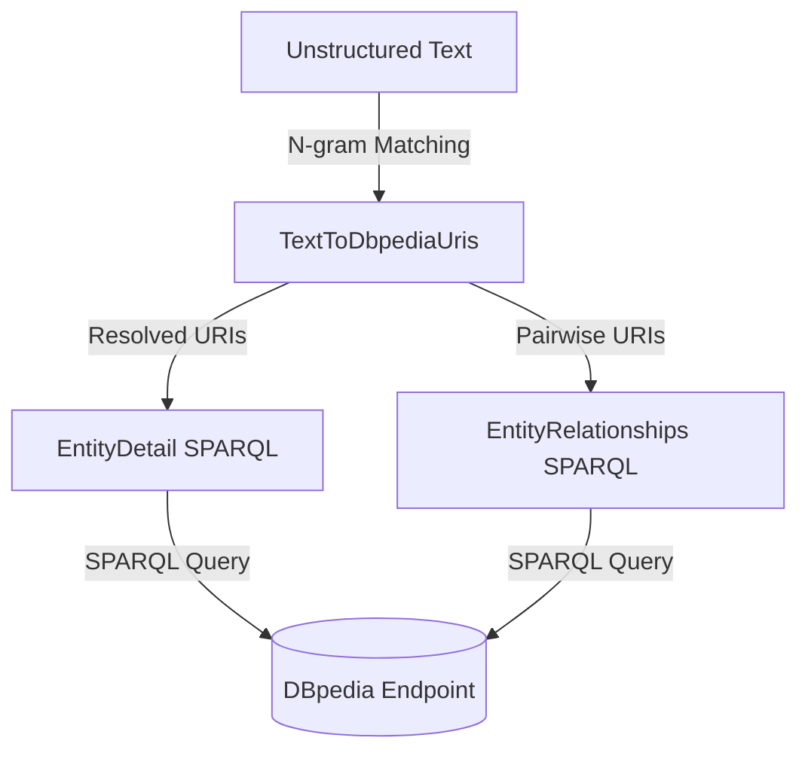

# Knowledge Graph Navigator (KGN)

A primary challenge in AI is bridging the gap between unstructured human language and structured knowledge. In this chapter, we build a **Knowledge Graph Navigator (KGN)** in Scala 3. KGN parses unstructured natural language sentences, extracts recognized entities, resolves them to global Uniform Resource Identifiers (URIs) on DBpedia, and queries the DBpedia SPARQL endpoint to fetch detailed biographies and discover relationships between the entities.

All code is in `source-code/kgn`.

## The Grounding Problem and Entity Linking

This chapter joins the two preceding ones. The NLP chapter found names in text; the Semantic Web chapter queried structured knowledge graphs. The gap between them is the **grounding problem**: a knowledge graph knows facts about `http://dbpedia.org/resource/Apple_Inc.`, but a person writes "Apple". Connecting the words people write to the exact things a machine knows about is the task called **entity linking** (or named-entity disambiguation).

It helps to separate two steps that sound alike. **Named Entity Recognition**, from the NLP chapter, finds the span of text that names something ("Steve Jobs"). **Entity linking** goes further and resolves that span to one specific, unique identifier in a knowledge base. The hard part is **ambiguity**: "Apple" is a company and a fruit, "Washington" is a person, a city, and a state, and "Jordan" is a country and several people. A mention on its own does not pick out one entity, so a linker must choose.

Two families of solution exist. Learned linkers (such as DBpedia Spotlight or modern neural systems) use the surrounding context and statistics to guess the intended entity. KGN takes the simpler **gazetteer** route: it keeps dictionaries that map known names directly to URIs and resolves ambiguity by a fixed category priority. This needs no training and is fully transparent, at the cost of missing names absent from its lists and resolving ambiguous names by rule rather than by context. For a bounded domain it is an effective and inspectable design.

## How KGN Works

KGN implements a lightweight pipeline that mirrors the structure of the grounding problem:
1. **Entity Mapping**: Parse input text and match n-grams against dictionary lists (gazetteers) linking common terms to DBpedia URIs.
2. **Detail Retrieval**: For each extracted entity, query its properties (e.g. spouse, Alma Mater, net income, population) using specialized SPARQL templates.
3. **Relationship Discovery**: Query DBpedia to find semantic edges that directly connect pairs of extracted entities.



This shape, extract then retrieve then reason, is worth noticing because it reappears in modern systems. A retrieval-augmented generation (RAG) pipeline and a tool-using LLM agent both follow the same arc: turn a question into a structured lookup, fetch facts from an external source, then combine them into an answer. KGN is a fully classical version of that pattern, with dictionaries and SPARQL standing in for embeddings and a language model.

## Extracting and Resolving Entities

In **kgn/TextToDbpediaUris.scala**, we load maps for categories such as people, companies, cities, and countries from text files. Each gazetteer is a tab-separated file pairing a surface name with its DBpedia URI, and the loader builds one dictionary per category (nine categories, several thousand entries in total).

When text is entered, the engine tokenizes it and performs a sliding-window n-gram match to resolve terms to DBpedia URIs. Crucially, it tries the **longest match first**, testing a 3-gram before a 2-gram before a single word:

```scala
class TextToDbpediaUris(text: String, allMaps: Map[String, Map[String, String]]):
  val personUris = collection.mutable.ListBuffer[String]()
  val personNames = collection.mutable.ListBuffer[String]()
  val companyUris = collection.mutable.ListBuffer[String]()
  val companyNames = collection.mutable.ListBuffer[String]()
  ...

  private def processText(): Unit =
    var i = 0
    val size = tokens.length - 2
    while i < size do
      val n3gram = s"${tokens(i)} ${tokens(i + 1)} ${tokens(i + 2)}"
      val n2gram = s"${tokens(i)} ${tokens(i + 1)}"

      // Try 3-gram match (longest match first)
      val skip3 = tryMatch(n3gram, 3, i)
      if skip3 > 0 then
        i += skip3
      else
        val skip2 = tryMatch(n2gram, 2, i)
        if skip2 > 0 then
          i += skip2
        else
          val skip1 = tryMatch(tokens(i), 1, i)
          if skip1 > 0 then i += skip1
          else i += 1
```

The longest-match rule is what makes "Apple Computer" resolve as the two-word company rather than as the single word "Apple", and it advances the index past the whole matched span so each mention is consumed once. Disambiguation happens inside `tryMatch`, which checks the categories in a fixed **priority order**, person first, then city, company, country, and the rest:

```scala
  private def tryMatch(ngram: String, n: Int, startIndex: Int): Int =
    val checkOrder = List(
      "person", "city", "company", "country",
      "broadcastNetwork", "musicGroup", "politicalParty",
      "tradeUnion", "university"
    )
    var matchedSkip = 0
    var categories = checkOrder
    while categories.nonEmpty && matchedSkip == 0 do
      val catName = categories.head
      categories = categories.tail
      val map = allMaps(catName)
      map.get(ngram) match
        case Some(uri) => ...  // record the match and stop
        case None => // try next category
    matchedSkip
```

This ordering is the whole disambiguation policy: when a name appears in more than one gazetteer, the first category in `checkOrder` wins. It is a blunt rule compared to a context-aware linker, but it is predictable, and for the demo queries it resolves each mention correctly. If a match is found, the URI is cached (e.g., `"Bill Gates"` maps to `<http://dbpedia.org/resource/Bill_Gates>`).

## Fetching Entity Details with SPARQL Templates

Once we have a resolved DBpedia URI, we want to retrieve its properties. We define template queries for each entity type in **kgn/EntityDetail.scala**. These templates lean on two SPARQL features that matter when querying a large, messy, real-world graph:

```scala
object EntityDetail:

  def personAsString(entityUri: String): String =
    val query = personTemplate.format(entityUri, entityUri, entityUri, entityUri, entityUri)
    SparqlClient.query(query).toString

  private val personTemplate =
    """|SELECT DISTINCT
       |    (GROUP_CONCAT (DISTINCT ?birthplace2; SEPARATOR=' | ') AS ?birthplace)
       |    (GROUP_CONCAT (DISTINCT ?label2; SEPARATOR=' | ') AS ?label)
       |    (GROUP_CONCAT (DISTINCT ?comment2; SEPARATOR=' | ') AS ?comment)
       |    (GROUP_CONCAT (DISTINCT ?almamater2; SEPARATOR=' | ') AS ?almamater)
       |    (GROUP_CONCAT (DISTINCT ?spouse2; SEPARATOR=' | ') AS ?spouse) {
       |  %s <http://www.w3.org/2000/01/rdf-schema#label> ?label2 .
       |            FILTER (lang(?label2) = 'en') .
       |  OPTIONAL { %s <http://www.w3.org/2000/01/rdf-schema#comment> ?comment2 . FILTER (lang(?comment2) = 'en') } .
       |  OPTIONAL { %s <http://dbpedia.org/ontology/birthPlace> ?birthplace2 } .
       |  OPTIONAL { %s <http://dbpedia.org/ontology/almaMater> ?almamater2 } .
       |  OPTIONAL { %s <http://dbpedia.org/ontology/spouse> ?spouse2 } .
       |} LIMIT 10""".stripMargin
```

The first feature is `OPTIONAL`. Recall the Open World Assumption from the last chapter: a real entity may be missing a birthplace or a spouse, and a plain graph pattern that required every field would return nothing for such an entity. `OPTIONAL` acts like a left outer join, so a match still succeeds when the optional fields are absent, and only the label is truly required. The second feature is `GROUP_CONCAT`, an aggregation function that collapses many values into one string. DBpedia often lists several birthplaces or two alma maters for one person, and `GROUP_CONCAT` folds them into a single ` | `-separated field so each entity comes back as one tidy row. The `FILTER (lang(?label2) = 'en')` clauses keep only English labels, since DBpedia stores text in dozens of languages. Similar templates are defined for companies (fetching net income and employee counts) and cities (fetching coordinates and population density).

## Discovering Semantic Relationships

To discover how two entities relate, we search for direct predicates connecting their URIs. This is the same technique as the Bill Gates and Microsoft query from the Semantic Web chapter: fix the subject and object, leave the predicate as a variable, and let the graph report every edge between the two nodes. In **kgn/EntityRelationships.scala**, we add a filter to remove noise:

```scala
object EntityRelationships:
  def results(entity1Uri: String, entity2Uri: String): QueryResult =
    val query =
      s"""|SELECT ?p WHERE {
          |  $entity1Uri ?p $entity2Uri .
          |  FILTER (!regex(str(?p), 'wikiPage', 'i'))
          |} LIMIT 10
          |""".stripMargin
    SparqlClient.query(query)
```

The `FILTER (!regex(str(?p), 'wikiPage', 'i'))` clause drops predicates whose names contain "wikiPage". DBpedia records a great many `wikiPageWikiLink` edges that merely mean one Wikipedia article links to another, which says nothing about a real-world relationship. Filtering them out leaves the meaningful predicates like `founder` and `keyPerson`. The driver in **kgn/Main.scala** runs this query over every pair of extracted entities, a Cartesian product that costs `O(n^2)`$ queries for `n`$ entities, which is fine for the handful of names in a sentence.

## Running the KGN Shell

The application in **kgn/Main.scala** hosts an interactive loop. Users can enter sentences or run built-in demos.

Launch the shell with:

```bash
scala-cli run .
```

If we input the query sentence:

`Steve Jobs worked at Apple Computer and visited IBM`

KGN tokenizes the text, matches the proper names, resolves them to DBpedia URIs, queries their properties, and finds relations:

```text
==================================================
Knowledge Graph Navigator (KGN) in Scala
==================================================
Loading entity maps from files...
Loaded 5231 entity mapping entries.

Enter entities query (or press Enter for a random demo, 'exit'/'quit' to leave):
Steve Jobs worked at Apple Computer and visited IBM

person	0	1	Steve Jobs	<http://dbpedia.org/resource/Steve_Jobs>
company	4	5	Apple Computer	<http://dbpedia.org/resource/Apple_Inc.>
company	8	8	IBM	<http://dbpedia.org/resource/IBM>

Individual People:
  Steve Jobs                : <http://dbpedia.org/resource/Steve_Jobs>
[QueryResult vars: [birthplace, label, comment, almamater, spouse]
Rows:
  [http://dbpedia.org/resource/San_Francisco | http://dbpedia.org/resource/California, Steve Jobs, Steven Paul Jobs was an American businessman, inventor, and investor best known for co-founding Apple Inc. ..., Reed College, http://dbpedia.org/resource/Laurene_Powell_Jobs]
]

Individual Companies:
  Apple Computer            : <http://dbpedia.org/resource/Apple_Inc.>
[QueryResult vars: [industry, netIncome, label, comment, numberOfEmployees]
Rows:
  [http://dbpedia.org/resource/Consumer_electronics | http://dbpedia.org/resource/Software, 9.7005E10, Apple Inc., Apple Inc. is an American multinational technology company..., 164000]
]
  IBM                       : <http://dbpedia.org/resource/IBM>
[QueryResult vars: [industry, netIncome, label, comment, numberOfEmployees]
Rows:
  [http://dbpedia.org/resource/Information_technology, 1.639E9, IBM, International Business Machines Corporation (IBM) is an American multinational technology corporation..., 288300]
]

Relationships between person 'Steve Jobs' and company 'Apple Inc.':
[QueryResult vars: [p]
Rows:
  [http://dbpedia.org/ontology/board]
  [http://dbpedia.org/ontology/founder]
  [http://dbpedia.org/property/founder]
  [http://dbpedia.org/ontology/keyPerson]
]
```

The first three lines of output are the entity-linking result: each mention is shown with its token span and the URI it resolved to. Note that "Apple Computer" linked to `Apple_Inc.` as a two-word company, exactly the longest-match behavior at work. The detail queries then returned Jobs's birthplace, alma mater, and spouse, and Apple's and IBM's industry, net income, and headcount, each assembled by `GROUP_CONCAT` from possibly many underlying triples. Finally, the relationship query discovered that Steve Jobs was a founder, key person, and board member of Apple Inc. KGN answered a question no single Wikipedia sentence states, by grounding the names in a knowledge graph and querying the structure directly.
